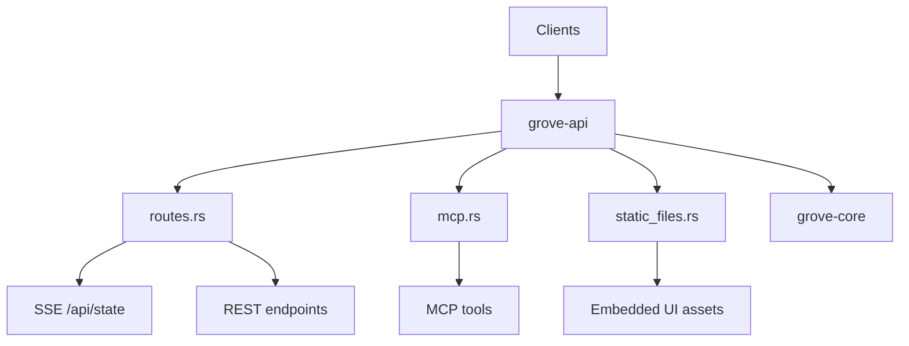
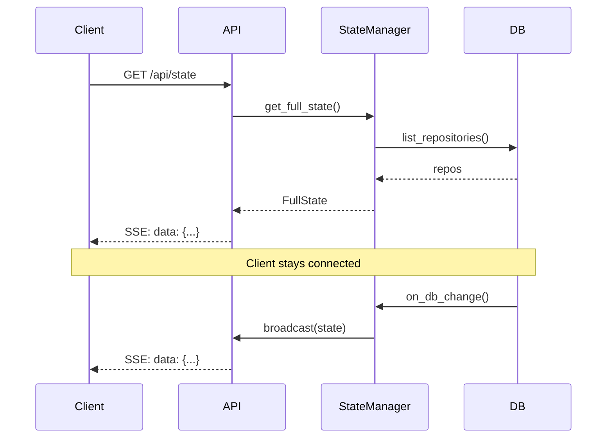

# grove-api

HTTP/SSE API server for grove. Serves the web dashboard and API endpoints.

## Overview



## Endpoints

| Method | Path                   | Description              |
| ------ | ---------------------- | ------------------------ |
| GET    | `/api/state`           | SSE stream of full state |
| GET    | `/api/state/snapshot`  | Current state (JSON)     |
| GET    | `/api/repositories`    | List all repositories    |
| POST   | `/api/clone`           | Clone a repository       |
| DELETE | `/api/repositories/:id`| Delete repository        |
| POST   | `/api/worktree`        | Create worktree          |
| DELETE | `/api/worktree/*path`  | Delete worktree          |
| POST   | `/api/open`            | Open path in VS Code     |
| POST   | `/api/refresh/:id`     | Refresh repository       |
| ANY    | `/mcp`                 | MCP endpoint             |
| GET    | `/*`                   | Static files (fallback)  |

---

## SSE State Stream

### Endpoint: GET /api/state

Pushes full state whenever anything changes. Clients connect once and receive updates.

```
function sse_handler(state_manager):
    # Send initial state immediately
    initial = state_manager.get_full_state()
    yield SSE_Event(data: json(initial))

    # Subscribe to changes
    receiver = state_manager.subscribe()

    # Stream updates
    while connected:
        state = receiver.recv()
        yield SSE_Event(data: json(state))

    # Keepalive (default interval)
    on_interval:
        yield SSE_Comment(":keepalive")
```



### Endpoint: GET /api/state/snapshot

Returns current state as JSON (non-streaming).

```
Response: { "repositories": [...], "progress": {} }
```

---

## Clone Endpoint

### POST /api/clone

```
Request:  { "url": "git@github.com:user/repo.git", "skip_install": false }
Response: { "ok": true } | { "ok": false, "error": "message" }
```

```
function clone_handler(request, state_manager, git_ops, db):
    url = request.url
    parsed = git_ops.parse_url(url)

    if not parsed:
        return { ok: false, error: "Invalid Git URL" }

    # Check if already exists
    if db.get_repository_by_name(parsed.provider, parsed.username, parsed.name):
        return { ok: false, error: "Repository already exists" }

    # Insert immediately (visible in UI)
    local_path = config.code_dir / parsed.username / parsed.name
    repo_id = db.insert_repository(...)
    state_manager.set_progress(repo_id, "Cloning repository...")
    state_manager.on_db_change()

    # Start clone in background task
    spawn_task:
        try:
            # Clone bare
            git_ops.clone_bare(url, local_path / ".bare")

            # Setup .git pointer
            write(local_path / ".git", "gitdir: ./.bare\n")

            # Configure and fetch
            git_ops.config(local_path, "remote.origin.fetch", "...")
            git_ops.fetch(local_path, "origin")

            # Detect default branch
            default_branch = git_ops.detect_default_branch(local_path)
            db.update_repository_default_branch(repo_id, default_branch)

            # Create .main worktree
            state_manager.set_progress(repo_id, "Creating main worktree...")
            main_path = local_path / ".main"
            git_ops.create_worktree(local_path, main_path, default_branch)
            db.insert_worktree(main_path, repo_id, default_branch)

            # Run install if package managers detected
            if not skip_install:
                for pm in detect_package_managers(main_path):
                    state_manager.set_progress(repo_id, f"Installing ({pm})...")
                    run_install(main_path, pm)

            # Update status
            status = git_ops.get_status(main_path)
            db.update_worktree_status(main_path, "ready", status)

            state_manager.set_progress(repo_id, null)
            state_manager.on_db_change()

        catch error:
            state_manager.set_progress(repo_id, null)
            cleanup(local_path)
            db.delete_repository(repo_id)
            state_manager.on_db_change()

    return { ok: true }
```

---

## MCP Endpoint

### ANY /mcp

Model Context Protocol endpoint for AI tool integration. Uses `rmcp` with streamable HTTP transport (stateless mode).

**Available Tools**:

| Tool                 | Input                      | Description                     |
| -------------------- | -------------------------- | ------------------------------- |
| `list_repositories`  | none                       | List all tracked repositories   |
| `clone_repository`   | `{ url: string }`          | Clone a git repository          |
| `delete_repository`  | `{ id: string }`           | Delete a repository             |
| `list_worktrees`     | `{ repo_id: string }`      | List worktrees for a repository |
| `create_worktree`    | `{ repo_id, branch }`      | Create worktree                 |
| `delete_worktree`    | `{ repo_id, path }`        | Delete worktree                 |
| `refresh_worktrees`  | `{ repo_id: string }`      | Fetch and update status         |

---

## Static File Serving

Embeds static files at compile time (fallback for non-API routes).

```
function static_handler(uri):
    path = uri.path.trim_start("/")

    # Try exact path
    if StaticAssets.get(path):
        return file with mime type

    # Try .html extension
    if StaticAssets.get(path + ".html"):
        return file

    # Try directory index
    if StaticAssets.get(path + "/index.html"):
        return file

    # Fallback to root index.html (SPA routing)
    return StaticAssets.get("index.html")
```

---

## Rust Mapping

| Pseudocode    | Rust                                |
| ------------- | ----------------------------------- |
| `spawn_task`  | `tokio::spawn`                      |
| `SSE_Event`   | `axum::response::sse::Event`        |
| `receiver`    | `broadcast::Receiver`               |
| `@Embed`      | `#[derive(rust_embed::Embed)]`      |
| `ServerHandler`| `rmcp::handler::server::ServerHandler` |
