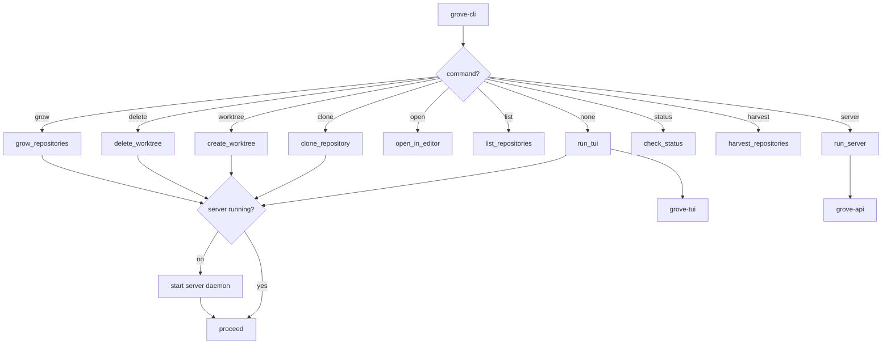
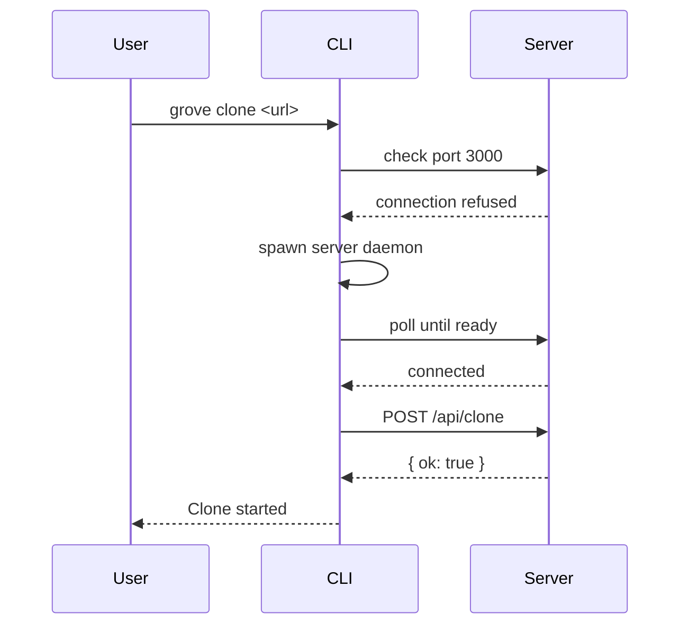

# grove-cli

CLI binary for grove. Entry point that handles commands and auto-starts server.

## Overview



## Commands

```
grove                      # Interactive TUI (default)
grove clone <url>          # Clone repository
grove worktree <repo> <branch>  # Create worktree
grove delete <path>        # Delete worktree
grove open <path>          # Open in VS Code
grove list                 # List repositories
grove server               # Start server in foreground
grove status               # Check server status
grove harvest <file>       # Export repos to seed.jsonl
grove grow <file>          # Import repos from seed.jsonl

Options:
  -p, --port <PORT>        Port for server [default: 3000, env: GROVE_PORT]
  -h, --help               Print help
  -V, --version            Print version
```

---

## Auto-Server Management

```
function ensure_server_running(port):
    if is_server_running(port):
        return Ok

    print("Starting server on port {port}...")

    # Spawn server as daemon
    exe = current_executable()
    spawn(exe, ["--port", port, "server"], {
        stdin: null,
        stdout: null,
        stderr: null,
    })

    # Wait for server to be ready (up to 5s)
    for attempt in 0..50:
        sleep(100ms)
        if is_server_running(port):
            return Ok

    return Error("Server failed to start")

function is_server_running(port):
    try:
        TcpStream.connect("127.0.0.1:{port}")
        return true
    catch:
        return false
```



---

## Main Entry Point

```
function main():
    cli = parse_args()

    match cli.command:
        # Commands that need server
        Clone { url }:
            ensure_server_running(cli.port)
            clone_repository(url)

        Worktree { repo, branch }:
            ensure_server_running(cli.port)
            create_worktree(repo, branch)

        Delete { path }:
            ensure_server_running(cli.port)
            delete_worktree(path)

        Grow { file }:
            ensure_server_running(cli.port)
            grow_repositories(file)

        # Offline commands
        Open { path }:
            open_in_editor(path)

        List:
            list_repositories()  # reads from DB directly

        Status:
            check_status()

        Harvest { file }:
            harvest_repositories(file)  # reads from DB directly

        # Server management
        Server:
            run_server(cli.port)

        # Default: interactive TUI
        None:
            ensure_server_running(cli.port)
            run_tui()
```

---

## One-Off Commands

```
function clone_repository(port, url):
    response = http_post(
        "http://localhost:{port}/api/clone",
        { url: url }
    )

    if response.ok:
        print("Clone started: {url}")
    else:
        print("Error: {response.error}")

function create_worktree(port, repo, branch):
    response = http_post(
        "http://localhost:{port}/api/worktree",
        { repo_id: repo, branch: branch }
    )

    if response.ok:
        print("Worktree created: {branch}")
    else:
        print("Error: {response.error}")

function delete_worktree(port, path):
    response = http_delete(
        "http://localhost:{port}/api/worktree/{path}"
    )

    if response.ok:
        print("Worktree deleted: {path}")
    else:
        print("Error: {response.error}")

function list_repositories():
    repos = db.list_repositories()
    for repo in repos:
        print("{repo.name} - {repo.clone_url}")
        for worktree in db.list_worktrees(repo.id):
            print("  ● {worktree.branch} ({worktree.path})")
```

---

## Harvest / Grow

### Seed File Format (JSONL)

```jsonl
{"url":"git@github.com:user/repo.git","worktrees":["feature-a","feature-b"]}
{"url":"git@github.com:user/other.git"}
```

### Harvest (Export)

```
function harvest_repositories(file):
    repos = db.list_repositories()
    lines = []

    for repo in repos:
        worktrees = db.list_worktrees(repo.id)
        # Exclude .main, only include additional branches
        branches = worktrees
            .filter(wt -> !wt.path.ends_with("/.main"))
            .map(wt -> wt.branch)

        lines.push(json({ url: repo.clone_url, worktrees: branches }))

    write_file(file, lines.join("\n"))
```

### Grow (Import)

```
function grow_repositories(port, file):
    entries = read_jsonl(file)

    for entry in entries:
        # Clone repository
        response = http_post("/api/clone", { url: entry.url })
        if not response.ok:
            continue

        # Wait for clone via SSE streaming
        if entry.worktrees:
            repo_id = wait_for_worktree_ready(entry.url)  # SSE stream

            # Create additional worktrees
            for branch in entry.worktrees:
                http_post("/api/worktree", { repo_id, branch })
```

The `grow` command uses SSE streaming to wait for clones to complete before creating worktrees.

---

## Rust Mapping

| Pseudocode           | Rust                              |
| -------------------- | --------------------------------- |
| `parse_args()`       | `clap::Parser::parse()`           |
| `spawn(...)`         | `std::process::Command::spawn()`  |
| `TcpStream.connect`  | `std::net::TcpStream::connect`    |
| `http_post`          | `reqwest::Client::post`           |
| `http_delete`        | `reqwest::Client::delete`         |
| `read_jsonl`         | `serde_json::from_str` per line   |
