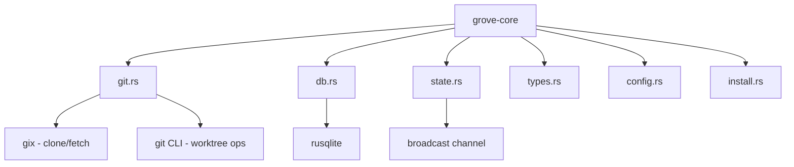
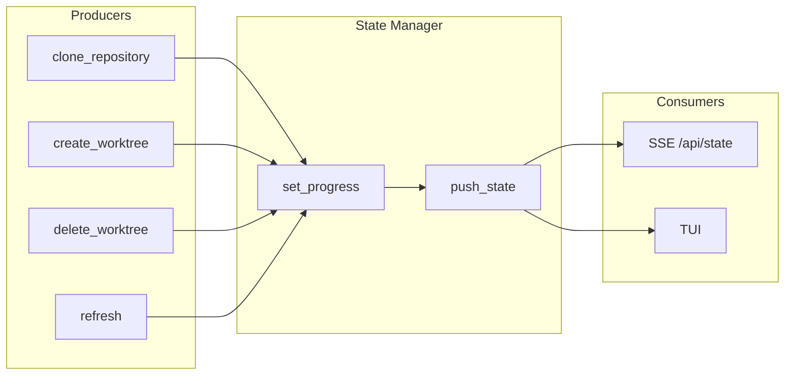
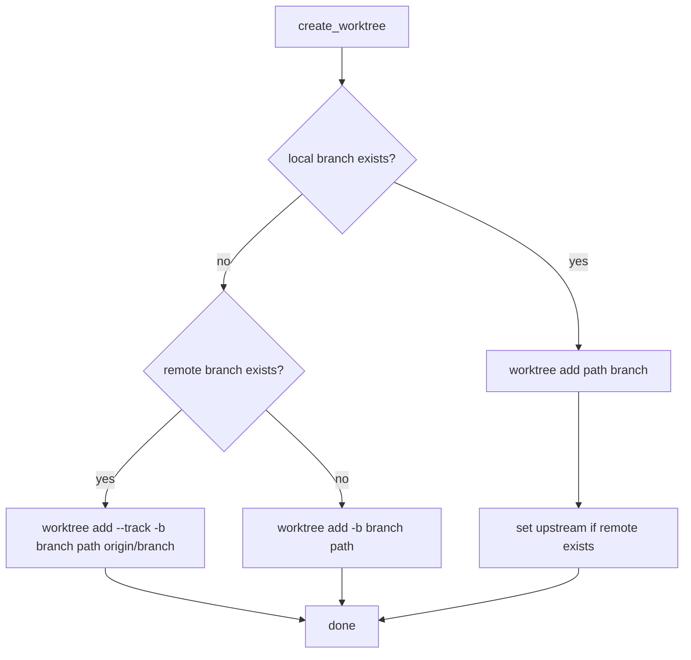

# grove-core

Core domain logic for grove. No HTTP, no UI - pure business logic.

## Overview



## Modules

| Module      | Purpose                                  |
| ----------- | ---------------------------------------- |
| `git.rs`    | Git operations via gix + git CLI         |
| `db.rs`     | SQLite database operations               |
| `state.rs`  | In-memory progress + broadcast           |
| `types.rs`  | Shared types (Repository, Worktree, etc) |
| `config.rs` | Configuration (paths, defaults)          |
| `install.rs`| Package manager detection + install      |

---

## config.rs

### Configuration

```rust
pub struct Config {
    /// Where repos are cloned (default: ~/code)
    pub code_dir: PathBuf,
    /// Grove data directory (default: ~/.grove)
    pub data_dir: PathBuf,
    /// Database path (default: ~/.grove/data/repos.db)
    pub db_path: PathBuf,
}
```

### Environment Variables

| Variable         | Default     | Description           |
| ---------------- | ----------- | --------------------- |
| `GROVE_ROOT`     | `~/.grove`  | Data directory        |
| `GROVE_CODE_DIR` | `~/code`    | Clone directory       |

---

## types.rs

### Core Types

```rust
// Repository record
pub struct Repository {
    pub id: String,
    pub provider: String,
    pub username: String,
    pub name: String,
    pub clone_url: String,
    pub local_path: String,
    pub repo_type: Option<String>,
    pub default_branch: String,
    pub last_synced: i64,
    pub created_at: i64,
    pub deleted_at: Option<i64>,
}

// Worktree record
pub struct Worktree {
    pub path: String,
    pub repo_id: String,
    pub branch: String,
    pub head: Option<String>,
    pub status: WorktreeStatus,
    pub commit_message: Option<String>,
    pub dirty: bool,
    pub ahead: i32,
    pub behind: i32,
    pub last_status_check: Option<i64>,
    pub created_at: i64,
    pub deleted_at: Option<i64>,
}

// Worktree status
pub enum WorktreeStatus {
    Creating,
    Ready,
    Error,
    Deleting,
}

// Repository with worktrees (for full state)
pub struct RepoWithWorktrees {
    #[serde(flatten)]
    pub repo: Repository,
    pub worktrees: Vec<Worktree>,
}

// Worktree configuration
pub struct WorktreeConfig {
    pub repo_id: String,
    pub symlink_patterns: Option<String>,  // comma-separated
    pub copy_patterns: Option<String>,     // comma-separated
    pub upstream_remote: String,
}

// Git status
pub struct GitStatus {
    pub branch: String,
    pub head: Option<String>,
    pub dirty: bool,
    pub ahead: i32,
    pub behind: i32,
    pub commit_message: Option<String>,
}
```

---

## db.rs

### Database Schema

Located in `schema.sql`:

```sql
CREATE TABLE IF NOT EXISTS repositories (
    id TEXT PRIMARY KEY,
    provider TEXT NOT NULL,
    username TEXT NOT NULL,
    name TEXT NOT NULL,
    clone_url TEXT NOT NULL,
    local_path TEXT NOT NULL UNIQUE,
    type TEXT DEFAULT 'bare',
    default_branch TEXT NOT NULL DEFAULT 'main',
    last_synced INTEGER NOT NULL,
    created_at INTEGER NOT NULL DEFAULT (unixepoch() * 1000),
    deleted_at INTEGER,
    UNIQUE(provider, username, name)
);

CREATE TABLE IF NOT EXISTS worktrees (
    path TEXT PRIMARY KEY,
    repo_id TEXT NOT NULL REFERENCES repositories(id),
    branch TEXT NOT NULL,
    head TEXT,
    status TEXT NOT NULL CHECK(status IN ('creating', 'ready', 'error', 'deleting')),
    commit_message TEXT,
    dirty INTEGER DEFAULT 0,
    ahead INTEGER DEFAULT 0,
    behind INTEGER DEFAULT 0,
    last_status_check INTEGER,
    created_at INTEGER NOT NULL DEFAULT (unixepoch() * 1000),
    deleted_at INTEGER
);

CREATE TABLE IF NOT EXISTS worktree_config (
    repo_id TEXT PRIMARY KEY REFERENCES repositories(id),
    symlink_patterns TEXT,
    copy_patterns TEXT,
    upstream_remote TEXT DEFAULT 'origin'
);

CREATE INDEX IF NOT EXISTS idx_worktrees_repo_id ON worktrees(repo_id);
CREATE INDEX IF NOT EXISTS idx_repositories_deleted ON repositories(deleted_at);
CREATE INDEX IF NOT EXISTS idx_worktrees_deleted ON worktrees(deleted_at);
```

### Database Operations

```
// Connection with mutex
struct Database { conn: Mutex<Connection> }

// Repository operations
list_repositories() -> Vec<Repository>         // WHERE deleted_at IS NULL
get_repository(id) -> Option<Repository>
get_repository_by_name(provider, username, name) -> Option<Repository>
get_repository_by_path(path) -> Option<Repository>
insert_repository(repo) -> String              // returns id
delete_repository(id)                          // hard delete (CASCADE)
update_repository_synced(id)
update_repository_default_branch(id, branch)

// Worktree operations
list_worktrees(repo_id) -> Vec<Worktree>
get_worktree(path) -> Option<Worktree>
insert_worktree(worktree)
update_worktree_status(path, status, head, commit_message)
update_worktree_git_status(path, dirty, ahead, behind)
delete_worktree(path)                          // hard delete

// Config operations
get_worktree_config(repo_id) -> Option<WorktreeConfig>
upsert_worktree_config(config)
```

---

## state.rs

### State Model

```rust
pub struct FullState {
    pub repositories: Vec<RepoWithWorktrees>,
    pub progress: HashMap<String, String>,  // id/path -> message
}
```

### StateManager

```rust
impl StateManager {
    /// Create new state manager with database reference
    pub fn new(db: Arc<Database>) -> Arc<Self>

    /// Subscribe to state changes (returns broadcast receiver)
    pub fn subscribe(&self) -> broadcast::Receiver<FullState>

    /// Set progress message (None to clear)
    pub fn set_progress(&self, path: &str, message: Option<&str>)

    /// Get current full state
    pub fn get_full_state(&self) -> FullState

    /// Notify of database change (triggers push)
    pub fn on_db_change(&self)
}
```

### Push Model



---

## git.rs

### GitOps

```rust
impl GitOps {
    /// Parse git URL into components
    pub fn parse_url(url: &str) -> Option<ParsedGitUrl>

    /// Clone bare repository
    pub async fn clone_bare(url: &str, path: &Path, progress: impl Fn(&str)) -> Result<()>

    /// Configure git setting
    pub fn config(path: &Path, key: &str, value: &str) -> Result<()>

    /// Fetch from remote
    pub async fn fetch(path: &Path, remote: &str) -> Result<()>

    /// Pull current branch
    pub async fn pull(path: &Path) -> Result<()>

    /// Detect default branch from remote
    pub fn detect_default_branch(path: &Path) -> Result<String>

    /// Create worktree (handles local/remote/new branch cases)
    pub async fn create_worktree(repo_path: &Path, worktree_path: &Path, branch: &str, remote: &str) -> Result<()>

    /// Remove worktree
    pub async fn remove_worktree(repo_path: &Path, worktree_path: &Path) -> Result<()>

    /// Get git status for worktree
    pub fn get_status(path: &Path) -> Result<GitStatus>
}
```

### Create Worktree Flow



---

## install.rs

### Package Manager Detection

```rust
pub enum PackageManager {
    Npm,
    Yarn,
    Pnpm,
    Bun,
}

impl PackageManager {
    pub fn command(&self) -> &'static str  // "npm", "yarn", etc.
}

/// Detect package managers from lockfiles
pub fn detect_package_managers(path: &Path) -> Vec<PackageManager>

/// Run install command
pub fn run_install(path: &Path, pm: PackageManager) -> Result<()>

/// Share files from source to destination (symlinks + copies)
pub fn share_files(src: &Path, dst: &Path, symlink: &[&str], copy: &[&str]) -> Result<()>
```

---

## Rust Mapping

| Pseudocode     | Rust                              |
| -------------- | --------------------------------- |
| `Map<K, V>`    | `std::collections::HashMap<K, V>` |
| `broadcast`    | `tokio::sync::broadcast`          |
| `Mutex`        | `std::sync::Mutex`                |
| `RwLock`       | `std::sync::RwLock`               |
| `Arc`          | `std::sync::Arc`                  |
| `async fn`     | `async fn`                        |
| `Option`       | `Option<T>`                       |
| `Result`       | `anyhow::Result<T>`               |
