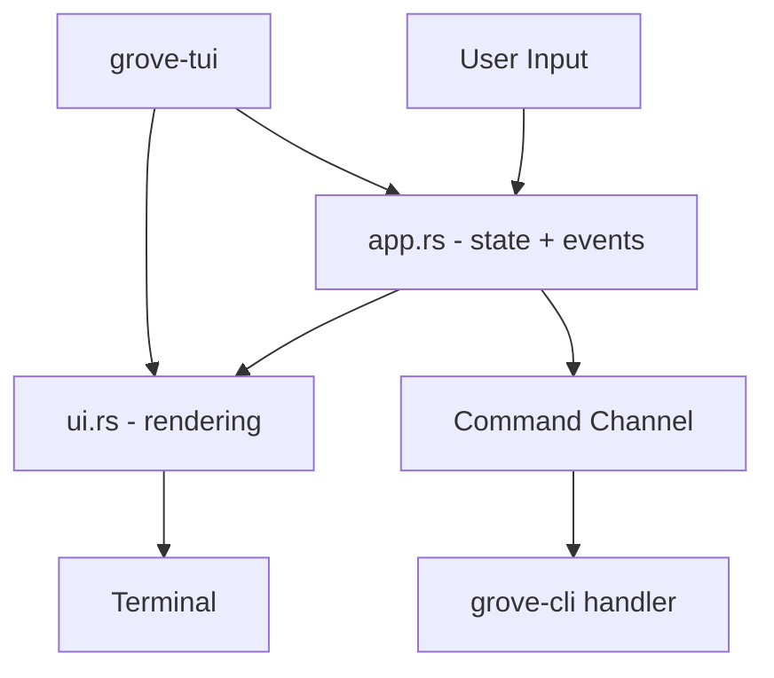
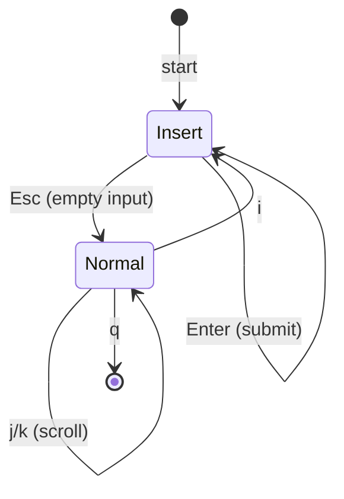

# grove-tui

Terminal chat UI for grove. Provides an interactive command interface.

## Overview



## UI Layout

```
┌─────────────────────────────────────────────────────┐
│ grove v0.2.0                                        │
│ http://localhost:3000 | [INSERT]                    │
├─────────────────────────────────────────────────────┤
│ 14:32 • Welcome to grove. Type /help for commands.  │
│                                                     │
│ 14:33 ❯ /clone git@github.com:user/repo.git         │
│                                                     │
│ 14:33 • Cloning git@github.com:user/repo.git...     │
│                                                     │
│ 14:34 ❯ /status                                     │
│                                                     │
│ 14:34 • Server running on http://localhost:3000     │
│                                                     │
├─────────────────────────────────────────────────────┤
│ Message (Enter to send, Shift+Enter for newline)    │
│ > _                                                 │
└─────────────────────────────────────────────────────┘
```

## State Machine



---

## App State

```rust
pub struct ChatApp {
    /// Chat messages
    pub messages: Vec<Message>,
    /// Text input
    pub input: TextArea<'static>,
    /// Scroll offset (from bottom)
    pub scroll_offset: usize,
    /// Current mode
    pub mode: Mode,
    /// Server status
    pub server_status: ServerStatus,
    /// Server port
    pub port: u16,
    /// Command sender
    command_tx: mpsc::Sender<Command>,
}

pub struct Message {
    pub role: Role,
    pub content: String,
    pub timestamp: DateTime<Local>,
}

pub enum Role {
    User,
    Assistant,
    System,
}

pub enum Mode {
    Insert,   // Typing mode
    Normal,   // Vim-style navigation
}

pub enum ServerStatus {
    Starting,
    Running { port: u16 },
    Error(String),
}

pub enum Command {
    Clone(String),
    CreateWorktree { repo_id: String, branch: String },
    DeleteWorktree { path: String },
    Open(String),
    Refresh(String),
    Quit,
}
```

---

## Event Loop

```
function run(terminal):
    loop:
        # Render UI
        terminal.draw(|frame| render(frame, app))

        # Poll for events (50ms timeout)
        if poll(50ms):
            event = read()
            if handle_key(event) == Quit:
                break

function handle_key(event):
    match app.mode:
        Insert:
            match event:
                Enter -> submit_message()
                Shift+Enter -> input.newline()
                Esc (empty) -> mode = Normal
                Esc (text) -> clear input
                Ctrl+C -> return Quit
                Ctrl+Up | PageUp -> scroll_up(10)
                Ctrl+Down | PageDown -> scroll_down(10)
                _ -> input.handle(event)

        Normal:
            match event:
                'i' -> mode = Insert
                'q' -> return Quit
                'j' -> scroll_down(1)
                'k' -> scroll_up(1)
                'G' -> scroll_to_bottom()
                'g' -> scroll_to_top()
```

---

## Slash Commands

```
/help, /?              Show available commands
/clone <url>           Clone a repository
/worktree <branch>     Create worktree (planned)
/delete <path>         Delete a worktree (planned)
/open <path>           Open in VS Code (planned)
/list                  List repositories (planned)
/refresh               Refresh all (planned)
/status                Show server status
/quit, /q              Exit grove
```

Commands send messages to the command channel for the CLI to handle.

---

## Rust Mapping

| Pseudocode       | Rust                                                |
| ---------------- | --------------------------------------------------- |
| `TextArea`       | `tui_textarea::TextArea`                            |
| `poll(50ms)`     | `crossterm::event::poll(Duration::from_millis(50))` |
| `terminal.draw`  | `Terminal::draw`                                    |
| `now()`          | `chrono::Local::now()`                              |
| `mpsc::channel`  | `tokio::sync::mpsc::channel`                        |
