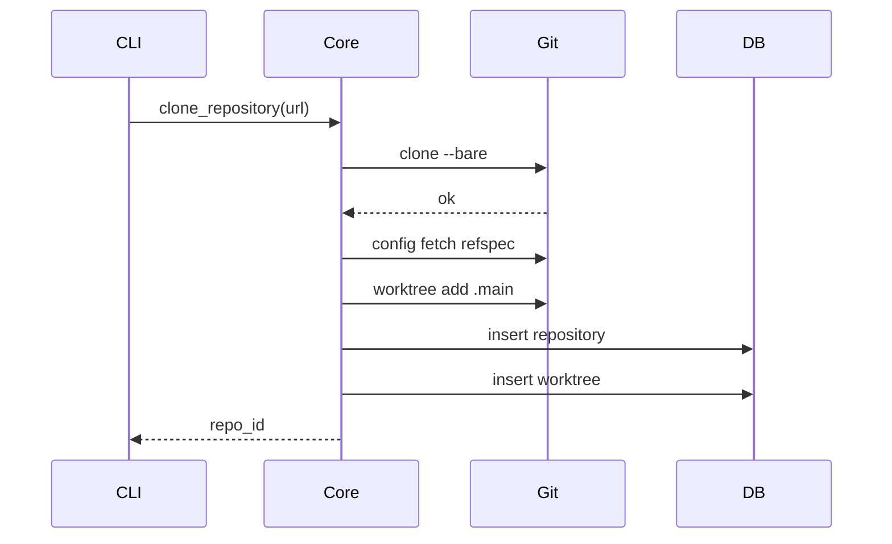
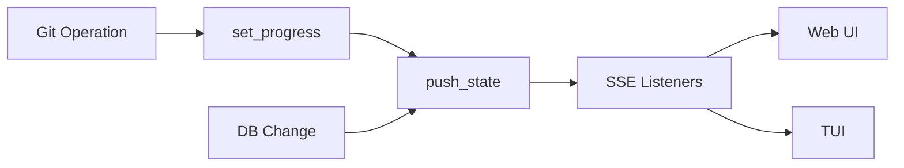

# Grove Rust Rewrite Plan

## Overview

Rewrite grove backend in Rust with gitoxide for git operations and ratatui for terminal UI. The `grove` command becomes an interactive chat interface (like `claude`) with embedded web dashboard.

**Key decisions:**
- **Static export** for Next.js - no Bun/Node runtime needed at all
- Web UI becomes a SPA, fetches state from Rust API on load
- Single Rust binary embeds static HTML/JS/CSS via `rust-embed`
- ~5MB total vs current ~45MB

## Architecture

```
grove/
├── crates/
│   ├── grove-core/
│   │   ├── spec.md           # Pseudocode + diagrams for domain logic
│   │   └── src/
│   │       ├── git.rs
│   │       ├── db.rs
│   │       └── state.rs
│   │
│   ├── grove-api/
│   │   ├── spec.md           # API routes, SSE flow diagrams
│   │   └── src/
│   │
│   ├── grove-tui/
│   │   ├── spec.md           # Chat UI flow, LLM integration diagrams
│   │   └── src/
│   │
│   └── grove-cli/
│       ├── spec.md           # CLI commands, auto-server flow
│       └── src/
│
├── src/                      # Next.js static export (dashboard)
│   ├── app/
│   └── lib/
├── next.config.js            # output: 'export'
│
├── Cargo.toml                # Workspace
└── rust-toolchain.toml
```

## Documentation Pattern

Each crate's `spec.md` includes:

1. **Overview** - What this crate does in plain English
2. **Pseudocode** - Logic without Rust syntax
3. **Mermaid diagrams** - Data flow, state machines, sequences
4. **Rust mapping** - How pseudocode maps to actual code

Example `grove-core/spec.md`:

~~~markdown
# grove-core

## Overview
Domain logic for git operations, database, and state management.
No HTTP, no UI - pure business logic.

## Git Operations

### Clone Flow (Pseudocode)
```
function clone_repository(url):
    path = parse_url_to_local_path(url)

    if path already exists:
        return error("already exists")

    # Clone as bare repo
    run: git clone --bare {url} {path}/.bare

    # Point .git to bare
    write "{path}/.git" = "gitdir: ./.bare"

    # Configure fetch
    run: git config remote.origin.fetch "+refs/heads/*:refs/remotes/origin/*"

    # Create main worktree
    default_branch = detect_default_branch()
    run: git worktree add .main {default_branch}

    # Save to database
    repo_id = db.insert_repository(...)
    db.insert_worktree(repo_id, ".main", default_branch)

    return repo_id
```

### Clone Flow (Diagram)


## State Management

### Push Model (Pseudocode)
```
# In-memory state
progress = Map<path, message>
listeners = Set<callback>

function set_progress(path, message):
    if message is null:
        progress.delete(path)
    else:
        progress.set(path, message)
    push_state()

function push_state():
    state = {
        repositories: db.list_all_with_worktrees(),
        progress: progress.to_object()
    }
    for listener in listeners:
        listener(state)

function subscribe(callback):
    listeners.add(callback)
    return () => listeners.remove(callback)
```

### State Flow (Diagram)

~~~

## Web UI (Static Export)

The Next.js app builds to static HTML/JS/CSS. No server-side rendering, no Server Actions.

### next.config.js

```js
/** @type {import('next').NextConfig} */
module.exports = {
  output: 'export',
  // Static export doesn't support image optimization
  images: { unoptimized: true },
  // All routes become static HTML files
  trailingSlash: true,
}
```

### Client-Side Data Fetching

Replace Server Components with client-side fetching:

```tsx
// src/app/page.tsx
'use client'

import { useEffect, useState } from 'react'
import { RepositoryTable } from '@/components/repository-table'
import type { FullState } from '@/lib/types'

export default function Home() {
  const [state, setState] = useState<FullState | null>(null)

  useEffect(() => {
    // Connect to SSE for real-time updates
    const eventSource = new EventSource('/api/state')

    eventSource.onmessage = (event) => {
      const data = JSON.parse(event.data) as FullState
      setState(data)
    }

    eventSource.onerror = () => {
      eventSource.close()
      // Fallback to polling or reconnect logic
    }

    return () => eventSource.close()
  }, [])

  if (!state) {
    return <div>Loading...</div>
  }

  return <RepositoryTable repositories={state.repositories} progress={state.progress} />
}
```

### API Calls (Client → Rust)

Replace Server Actions with fetch calls:

```tsx
// src/lib/api.ts
const API_BASE = '' // Same origin

export async function cloneRepository(url: string) {
  const res = await fetch(`${API_BASE}/api/clone`, {
    method: 'POST',
    headers: { 'Content-Type': 'application/json' },
    body: JSON.stringify({ url }),
  })
  if (!res.ok) throw new Error(await res.text())
  return res.json()
}

export async function createWorktree(repoId: string, branch: string) {
  const res = await fetch(`${API_BASE}/api/worktree`, {
    method: 'POST',
    headers: { 'Content-Type': 'application/json' },
    body: JSON.stringify({ repo_id: repoId, branch }),
  })
  if (!res.ok) throw new Error(await res.text())
  return res.json()
}

export async function deleteWorktree(path: string) {
  const res = await fetch(`${API_BASE}/api/worktree/${encodeURIComponent(path)}`, {
    method: 'DELETE',
  })
  if (!res.ok) throw new Error(await res.text())
  return res.json()
}

export async function openInVSCode(path: string) {
  const res = await fetch(`${API_BASE}/api/open`, {
    method: 'POST',
    headers: { 'Content-Type': 'application/json' },
    body: JSON.stringify({ path }),
  })
  if (!res.ok) throw new Error(await res.text())
  return res.json()
}
```

### Component Updates

Convert form actions to client-side handlers:

```tsx
// src/components/clone-form.tsx
'use client'

import { useState } from 'react'
import { cloneRepository } from '@/lib/api'

export function CloneForm() {
  const [url, setUrl] = useState('')
  const [loading, setLoading] = useState(false)
  const [error, setError] = useState<string | null>(null)

  const handleSubmit = async (e: React.FormEvent) => {
    e.preventDefault()
    if (!url.trim()) return

    setLoading(true)
    setError(null)

    try {
      await cloneRepository(url)
      setUrl('')
      // SSE will push the new state automatically
    } catch (err) {
      setError(err instanceof Error ? err.message : 'Clone failed')
    } finally {
      setLoading(false)
    }
  }

  return (
    <form onSubmit={handleSubmit}>
      <input
        type="text"
        value={url}
        onChange={(e) => setUrl(e.target.value)}
        placeholder="git@github.com:user/repo.git"
        disabled={loading}
      />
      <button type="submit" disabled={loading}>
        {loading ? 'Cloning...' : 'Clone'}
      </button>
      {error && <p className="error">{error}</p>}
    </form>
  )
}
```

### What We Lose (and Why It's Fine)

| Feature | Server Mode | Static Export | Impact |
|---------|-------------|---------------|--------|
| Server Components | ✓ | ✗ | Minimal - dashboard is small |
| Server Actions | ✓ | ✗ | Use REST API instead |
| SSR | ✓ | ✗ | Not needed for local tool |
| API Routes | ✓ | ✗ | Rust handles all APIs |
| Streaming SSR | ✓ | ✗ | Use SSE for real-time |

For a local dashboard, static export is sufficient. The client connects via SSE for real-time updates, just like before.

## Crate Breakdown

### grove-core

Domain logic, no IO dependencies on specific frameworks.

```rust
// crates/grove-core/src/lib.rs
pub mod git;
pub mod db;
pub mod state;
pub mod types;
pub mod config;
```

**git.rs** - gitoxide operations:
```rust
use gix::{Repository, Progress, interrupt};
use std::path::Path;
use tokio::sync::mpsc;

pub struct GitOps {
    progress_tx: mpsc::Sender<ProgressEvent>,
}

pub enum ProgressEvent {
    Clone { url: String, message: String },
    Fetch { repo: String, message: String },
    Done { repo: String },
    Error { repo: String, error: String },
}

impl GitOps {
    /// Clone repository as bare with progress streaming
    pub async fn clone_bare(&self, url: &str, path: &Path) -> Result<(), GitError> {
        let url = gix::url::parse(url.into())?;

        let mut prepare = gix::prepare_clone_bare(url, path)?
            .with_remote_name("origin")?;

        let (mut checkout, _outcome) = prepare
            .fetch_then_checkout(
                gix::progress::Discard,
                &interrupt::IS_INTERRUPTED,
            )?;

        // Configure remote fetch refspec
        let repo = checkout.persist()?;
        self.configure_fetch_refspec(&repo)?;

        Ok(())
    }

    /// Create worktree with smart branch detection
    pub async fn create_worktree(
        &self,
        repo_path: &Path,
        worktree_path: &Path,
        branch: &str,
    ) -> Result<(), GitError> {
        let repo = gix::open(repo_path)?;

        // Check if local branch exists
        if let Ok(_) = repo.find_reference(&format!("refs/heads/{}", branch)) {
            // Local exists - checkout
            repo.worktree(worktree_path)?
                .checkout(branch)?;
        } else if let Ok(_) = repo.find_reference(&format!("refs/remotes/origin/{}", branch)) {
            // Remote exists - create tracking branch
            repo.worktree(worktree_path)?
                .checkout_new_tracking(branch, &format!("origin/{}", branch))?;
        } else {
            // Neither - create new branch
            repo.worktree(worktree_path)?
                .checkout_new(branch)?;
        }

        Ok(())
    }

    /// Remove worktree
    pub async fn remove_worktree(
        &self,
        repo_path: &Path,
        worktree_path: &Path,
    ) -> Result<(), GitError> {
        let repo = gix::open(repo_path)?;
        repo.worktree_remove(worktree_path, /* force */ true)?;
        Ok(())
    }

    /// Get worktree status
    pub fn get_status(&self, worktree_path: &Path) -> Result<WorktreeStatus, GitError> {
        let repo = gix::open(worktree_path)?;

        let head = repo.head_ref()?.map(|r| r.id().to_string());
        let branch = repo.head_name()?.map(|n| n.shorten().to_string());

        // Check dirty status
        let dirty = repo.status()?
            .into_iter()
            .any(|entry| entry.is_some());

        // Get ahead/behind
        let (ahead, behind) = self.get_ahead_behind(&repo, branch.as_deref())?;

        // Get commit message
        let commit_message = repo.head_commit()
            .ok()
            .map(|c| c.message_raw_sloppy().to_string());

        Ok(WorktreeStatus {
            head,
            branch: branch.unwrap_or_default(),
            dirty,
            ahead,
            behind,
            commit_message,
        })
    }

    /// Fetch from remote
    pub async fn fetch(&self, repo_path: &Path, remote: &str) -> Result<(), GitError> {
        let repo = gix::open(repo_path)?;
        let mut remote = repo.find_remote(remote)?;

        remote.connect(gix::remote::Direction::Fetch)?
            .prepare_fetch(gix::progress::Discard, Default::default())?
            .receive(gix::progress::Discard, &interrupt::IS_INTERRUPTED)?;

        Ok(())
    }

    /// Pull (fetch + merge)
    pub async fn pull(&self, worktree_path: &Path) -> Result<(), GitError> {
        let repo = gix::open(worktree_path)?;
        // ... pull implementation
        Ok(())
    }
}

#[derive(Debug, Clone)]
pub struct WorktreeStatus {
    pub head: Option<String>,
    pub branch: String,
    pub dirty: bool,
    pub ahead: u32,
    pub behind: u32,
    pub commit_message: Option<String>,
}

#[derive(Debug, thiserror::Error)]
pub enum GitError {
    #[error("Git operation failed: {0}")]
    Gix(#[from] gix::Error),
    #[error("Repository not found: {0}")]
    NotFound(String),
    #[error("Invalid URL: {0}")]
    InvalidUrl(String),
}
```

**db.rs** - SQLite with rusqlite:
```rust
use rusqlite::{Connection, params};
use std::path::PathBuf;
use std::sync::Mutex;

pub struct Database {
    conn: Mutex<Connection>,
}

impl Database {
    pub fn open(path: &Path) -> Result<Self, DbError> {
        let conn = Connection::open(path)?;
        conn.execute_batch(include_str!("schema.sql"))?;
        Ok(Self { conn: Mutex::new(conn) })
    }

    pub fn list_repositories(&self) -> Result<Vec<Repository>, DbError> {
        let conn = self.conn.lock().unwrap();
        let mut stmt = conn.prepare(
            "SELECT id, provider, username, name, clone_url, local_path,
                    type, default_branch, last_synced
             FROM repositories WHERE deleted_at IS NULL"
        )?;

        let repos = stmt.query_map([], |row| {
            Ok(Repository {
                id: row.get(0)?,
                provider: row.get(1)?,
                username: row.get(2)?,
                name: row.get(3)?,
                clone_url: row.get(4)?,
                local_path: row.get(5)?,
                repo_type: row.get(6)?,
                default_branch: row.get(7)?,
                last_synced: row.get(8)?,
            })
        })?.collect::<Result<Vec<_>, _>>()?;

        Ok(repos)
    }

    pub fn insert_repository(&self, repo: &NewRepository) -> Result<String, DbError> {
        let conn = self.conn.lock().unwrap();
        let id = uuid::Uuid::new_v4().to_string();

        conn.execute(
            "INSERT INTO repositories
             (id, provider, username, name, clone_url, local_path, type, default_branch, last_synced)
             VALUES (?1, ?2, ?3, ?4, ?5, ?6, ?7, ?8, ?9)",
            params![
                id, repo.provider, repo.username, repo.name, repo.clone_url,
                repo.local_path, repo.repo_type, repo.default_branch, repo.last_synced
            ],
        )?;

        Ok(id)
    }

    // ... other CRUD operations
}
```

**state.rs** - Broadcast state to SSE clients:
```rust
use tokio::sync::broadcast;
use std::collections::HashMap;

pub struct StateManager {
    tx: broadcast::Sender<FullState>,
    progress: std::sync::RwLock<HashMap<String, String>>,
    db: Arc<Database>,
}

impl StateManager {
    pub fn new(db: Arc<Database>) -> Self {
        let (tx, _) = broadcast::channel(16);
        Self {
            tx,
            progress: Default::default(),
            db,
        }
    }

    pub fn subscribe(&self) -> broadcast::Receiver<FullState> {
        self.tx.subscribe()
    }

    pub fn set_progress(&self, key: &str, message: Option<&str>) {
        let mut progress = self.progress.write().unwrap();
        match message {
            Some(msg) => progress.insert(key.to_string(), msg.to_string()),
            None => progress.remove(key),
        };
        drop(progress);
        self.push_state();
    }

    pub fn push_state(&self) {
        let state = self.get_full_state();
        let _ = self.tx.send(state);
    }

    pub fn get_full_state(&self) -> FullState {
        let repos = self.db.list_repositories().unwrap_or_default();
        let progress = self.progress.read().unwrap().clone();

        FullState {
            repositories: repos.into_iter().map(|r| {
                let worktrees = self.db.list_worktrees(&r.id).unwrap_or_default();
                RepoWithWorktrees { repo: r, worktrees }
            }).collect(),
            progress,
        }
    }
}
```

### grove-api

HTTP server with axum.

```rust
// crates/grove-api/src/lib.rs
use axum::{
    Router,
    routing::{get, post},
    extract::State,
    response::sse::{Event, Sse},
    Json,
};
use std::sync::Arc;
use grove_core::{StateManager, GitOps, Database};

pub struct AppState {
    pub state: Arc<StateManager>,
    pub git: Arc<GitOps>,
    pub db: Arc<Database>,
}

pub fn router(state: AppState) -> Router {
    Router::new()
        // SSE state stream
        .route("/api/state", get(sse_handler))

        // Repository operations
        .route("/api/clone", post(clone_handler))
        .route("/api/repositories", get(list_repos_handler))
        .route("/api/repositories/:id", delete(delete_repo_handler))

        // Worktree operations
        .route("/api/worktree", post(create_worktree_handler))
        .route("/api/worktree/:path", delete(delete_worktree_handler))
        .route("/api/worktree/:path/open", post(open_worktree_handler))

        // Refresh
        .route("/api/refresh/:id", post(refresh_handler))

        // Static files (embedded Next.js export)
        .fallback(static_handler)

        .with_state(Arc::new(state))
}

// Embed static files from Next.js export at compile time
#[derive(rust_embed::Embed)]
#[folder = "../out"]  // Next.js static export output
struct StaticAssets;

async fn static_handler(uri: axum::http::Uri) -> impl axum::response::IntoResponse {
    use axum::http::{header, StatusCode};
    use axum::response::IntoResponse;

    let path = uri.path().trim_start_matches('/');

    // Try exact path first
    if let Some(content) = StaticAssets::get(path) {
        let mime = mime_guess::from_path(path).first_or_octet_stream();
        return (
            StatusCode::OK,
            [(header::CONTENT_TYPE, mime.as_ref())],
            content.data.into_owned(),
        ).into_response();
    }

    // Try with .html extension (for clean URLs)
    let html_path = if path.is_empty() {
        "index.html".to_string()
    } else if !path.ends_with(".html") {
        format!("{}.html", path.trim_end_matches('/'))
    } else {
        path.to_string()
    };

    if let Some(content) = StaticAssets::get(&html_path) {
        return (
            StatusCode::OK,
            [(header::CONTENT_TYPE, "text/html")],
            content.data.into_owned(),
        ).into_response();
    }

    // Try index.html in directory
    let index_path = format!("{}/index.html", path.trim_end_matches('/'));
    if let Some(content) = StaticAssets::get(&index_path) {
        return (
            StatusCode::OK,
            [(header::CONTENT_TYPE, "text/html")],
            content.data.into_owned(),
        ).into_response();
    }

    // Fallback to root index.html (SPA routing)
    if let Some(content) = StaticAssets::get("index.html") {
        return (
            StatusCode::OK,
            [(header::CONTENT_TYPE, "text/html")],
            content.data.into_owned(),
        ).into_response();
    }

    (StatusCode::NOT_FOUND, "Not found").into_response()
}

async fn sse_handler(
    State(state): State<Arc<AppState>>,
) -> Sse<impl futures::Stream<Item = Result<Event, std::convert::Infallible>>> {
    let mut rx = state.state.subscribe();

    // Send initial state
    let initial = state.state.get_full_state();

    let stream = async_stream::stream! {
        yield Ok(Event::default().json_data(&initial).unwrap());

        while let Ok(state) = rx.recv().await {
            yield Ok(Event::default().json_data(&state).unwrap());
        }
    };

    Sse::new(stream).keep_alive(
        axum::response::sse::KeepAlive::new()
            .interval(std::time::Duration::from_secs(30))
    )
}

async fn clone_handler(
    State(state): State<Arc<AppState>>,
    Json(req): Json<CloneRequest>,
) -> Result<Json<CloneResponse>, ApiError> {
    let result = state.git.clone_bare(&req.url, &req.path).await?;
    Ok(Json(CloneResponse { repo_id: result }))
}

// ... other handlers
```

### grove-tui

Chat interface with ratatui.

```rust
// crates/grove-tui/src/lib.rs
mod app;
mod ui;
mod input;
mod markdown;
mod llm;

pub use app::ChatApp;

// crates/grove-tui/src/llm.rs
//! LLM client with streaming and tool use support

use futures::StreamExt;
use reqwest_eventsource::{Event, EventSource};
use serde::{Deserialize, Serialize};
use tokio::sync::mpsc;

#[derive(Debug, Clone, Serialize)]
pub struct LlmRequest {
    pub messages: Vec<LlmMessage>,
    pub system: String,
}

#[derive(Debug, Clone, Serialize, Deserialize)]
pub struct LlmMessage {
    pub role: String,
    pub content: String,
}

#[derive(Debug, Clone)]
pub enum LlmEvent {
    Text(String),
    ToolCall { name: String, args: serde_json::Value },
    Done,
    Error(String),
}

pub struct LlmClient {
    api_key: String,
    api_url: String,
    model: String,
}

impl LlmClient {
    pub fn new() -> Self {
        Self {
            api_key: std::env::var("ANTHROPIC_API_KEY")
                .or_else(|_| std::env::var("OPENAI_API_KEY"))
                .unwrap_or_default(),
            api_url: std::env::var("LLM_API_URL")
                .unwrap_or_else(|_| "https://api.anthropic.com/v1/messages".to_string()),
            model: std::env::var("LLM_MODEL")
                .unwrap_or_else(|_| "claude-sonnet-4-20250514".to_string()),
        }
    }

    /// Stream LLM response with tool use support
    pub async fn stream(
        &self,
        request: LlmRequest,
        event_tx: mpsc::Sender<LlmEvent>,
    ) -> anyhow::Result<()> {
        let tools = serde_json::json!([
            {
                "name": "clone_repository",
                "description": "Clone a git repository",
                "input_schema": {
                    "type": "object",
                    "properties": {
                        "url": { "type": "string", "description": "Git URL to clone" }
                    },
                    "required": ["url"]
                }
            },
            {
                "name": "create_worktree",
                "description": "Create a new worktree for a branch",
                "input_schema": {
                    "type": "object",
                    "properties": {
                        "repo_id": { "type": "string" },
                        "branch": { "type": "string" }
                    },
                    "required": ["repo_id", "branch"]
                }
            },
            {
                "name": "delete_worktree",
                "description": "Delete a worktree",
                "input_schema": {
                    "type": "object",
                    "properties": {
                        "path": { "type": "string" }
                    },
                    "required": ["path"]
                }
            },
            {
                "name": "open_in_editor",
                "description": "Open a worktree in VS Code",
                "input_schema": {
                    "type": "object",
                    "properties": {
                        "path": { "type": "string" }
                    },
                    "required": ["path"]
                }
            },
            {
                "name": "list_repositories",
                "description": "List all repositories and their worktrees",
                "input_schema": { "type": "object", "properties": {} }
            }
        ]);

        let body = serde_json::json!({
            "model": self.model,
            "max_tokens": 1024,
            "stream": true,
            "system": request.system,
            "messages": request.messages,
            "tools": tools,
        });

        let client = reqwest::Client::new();
        let res = client.post(&self.api_url)
            .header("x-api-key", &self.api_key)
            .header("anthropic-version", "2023-06-01")
            .header("content-type", "application/json")
            .json(&body)
            .send()
            .await?;

        let mut stream = EventSource::new(res)?;

        while let Some(event) = stream.next().await {
            match event {
                Ok(Event::Message(msg)) => {
                    let data: serde_json::Value = serde_json::from_str(&msg.data)?;

                    // Handle different event types
                    match data["type"].as_str() {
                        Some("content_block_delta") => {
                            if let Some(text) = data["delta"]["text"].as_str() {
                                event_tx.send(LlmEvent::Text(text.to_string())).await?;
                            }
                        }
                        Some("content_block_start") => {
                            if data["content_block"]["type"] == "tool_use" {
                                // Tool call starting
                            }
                        }
                        Some("message_delta") => {
                            if data["delta"]["stop_reason"] == "tool_use" {
                                // Extract tool calls from accumulated content
                                // ... handle tool execution
                            }
                        }
                        Some("message_stop") => {
                            event_tx.send(LlmEvent::Done).await?;
                            break;
                        }
                        _ => {}
                    }
                }
                Ok(Event::Open) => {}
                Err(e) => {
                    event_tx.send(LlmEvent::Error(e.to_string())).await?;
                    break;
                }
            }
        }

        Ok(())
    }
}

// crates/grove-tui/src/app.rs
use crossterm::event::{self, Event, KeyCode, KeyModifiers};
use ratatui::{prelude::*, widgets::*};
use tui_textarea::TextArea;
use tokio::sync::mpsc;

pub struct ChatApp {
    // UI State
    messages: Vec<Message>,
    input: TextArea<'static>,
    scroll_offset: usize,
    mode: Mode,

    // Server state
    server_status: ServerStatus,
    update_status: UpdateStatus,

    // Channels
    response_rx: mpsc::Receiver<ResponseChunk>,
    command_tx: mpsc::Sender<Command>,
}

pub struct Message {
    pub role: Role,
    pub content: String,
    pub timestamp: chrono::DateTime<chrono::Local>,
}

#[derive(Clone, Copy, PartialEq)]
pub enum Role {
    User,
    Assistant,
    System,
}

#[derive(Clone, Copy, PartialEq)]
pub enum Mode {
    Normal,
    Insert,
    Command,
}

pub enum ServerStatus {
    Starting,
    Running { port: u16 },
    Error(String),
}

pub enum UpdateStatus {
    Checking,
    Available { current: String, latest: String },
    Downloading,
    Installing,
    Complete(String),
    None,
    Error,
}

pub enum Command {
    Clone(String),
    CreateWorktree { repo_id: String, branch: String },
    DeleteWorktree { path: String },
    Refresh(String),
    Open(String),
    Quit,
}

pub enum ResponseChunk {
    Text(String),
    Done,
    Error(String),
}

impl ChatApp {
    pub fn new() -> (Self, mpsc::Sender<ResponseChunk>, mpsc::Receiver<Command>) {
        let (response_tx, response_rx) = mpsc::channel(100);
        let (command_tx, command_rx) = mpsc::channel(100);

        let mut input = TextArea::default();
        input.set_cursor_line_style(Style::default());
        input.set_placeholder_text("Type a message or /help for commands...");

        let app = Self {
            messages: vec![Message {
                role: Role::System,
                content: "Welcome to grove. Type /help for available commands.".into(),
                timestamp: chrono::Local::now(),
            }],
            input,
            scroll_offset: 0,
            mode: Mode::Insert,
            server_status: ServerStatus::Starting,
            update_status: UpdateStatus::Checking,
            response_rx,
            command_tx,
        };

        (app, response_tx, command_rx)
    }

    pub async fn run(&mut self, terminal: &mut Terminal<impl Backend>) -> anyhow::Result<()> {
        loop {
            terminal.draw(|f| self.render(f))?;

            // Handle input events with timeout to allow async updates
            if event::poll(std::time::Duration::from_millis(50))? {
                if let Event::Key(key) = event::read()? {
                    if self.handle_key(key).await? {
                        break; // Quit signal
                    }
                }
            }

            // Check for response chunks
            while let Ok(chunk) = self.response_rx.try_recv() {
                self.handle_response(chunk);
            }
        }
        Ok(())
    }

    async fn handle_key(&mut self, key: event::KeyEvent) -> anyhow::Result<bool> {
        match self.mode {
            Mode::Insert => {
                match (key.code, key.modifiers) {
                    // Submit message
                    (KeyCode::Enter, KeyModifiers::NONE) => {
                        let content = self.input.lines().join("\n");
                        if !content.trim().is_empty() {
                            self.submit_message(content).await?;
                        }
                    }
                    // Multi-line input
                    (KeyCode::Enter, KeyModifiers::SHIFT) => {
                        self.input.insert_newline();
                    }
                    // Cancel / clear
                    (KeyCode::Esc, _) => {
                        if self.input.is_empty() {
                            self.mode = Mode::Normal;
                        } else {
                            self.input.select_all();
                            self.input.cut();
                        }
                    }
                    // Quit
                    (KeyCode::Char('c'), KeyModifiers::CONTROL) => {
                        return Ok(true);
                    }
                    // Scroll up
                    (KeyCode::Up, KeyModifiers::CONTROL) |
                    (KeyCode::PageUp, _) => {
                        self.scroll_up(10);
                    }
                    // Scroll down
                    (KeyCode::Down, KeyModifiers::CONTROL) |
                    (KeyCode::PageDown, _) => {
                        self.scroll_down(10);
                    }
                    // Pass to textarea
                    _ => {
                        self.input.input(key);
                    }
                }
            }
            Mode::Normal => {
                match key.code {
                    KeyCode::Char('i') => self.mode = Mode::Insert,
                    KeyCode::Char('q') => return Ok(true),
                    KeyCode::Char('j') => self.scroll_down(1),
                    KeyCode::Char('k') => self.scroll_up(1),
                    KeyCode::Char('G') => self.scroll_to_bottom(),
                    KeyCode::Char('g') => self.scroll_to_top(),
                    _ => {}
                }
            }
            Mode::Command => {
                // Command palette mode (future)
            }
        }
        Ok(false)
    }

    async fn submit_message(&mut self, content: String) -> anyhow::Result<()> {
        // Add user message
        self.messages.push(Message {
            role: Role::User,
            content: content.clone(),
            timestamp: chrono::Local::now(),
        });

        // Clear input
        self.input.select_all();
        self.input.cut();

        // Scroll to bottom
        self.scroll_to_bottom();

        // Parse commands or send to LLM
        if content.starts_with('/') {
            self.handle_command(&content).await?;
        } else {
            // Send to LLM for natural language processing
            self.send_to_llm(&content).await?;
        }

        Ok(())
    }

    /// Send message to LLM and stream response
    async fn send_to_llm(&mut self, content: &str) -> anyhow::Result<()> {
        // Add placeholder for assistant response
        self.messages.push(Message {
            role: Role::Assistant,
            content: String::new(),
            timestamp: chrono::Local::now(),
        });

        // Build context: current repos, worktrees, etc.
        let context = self.build_context().await?;

        // Stream from LLM
        self.llm_tx.send(LlmRequest {
            messages: self.messages.iter().map(|m| LlmMessage {
                role: match m.role {
                    Role::User => "user",
                    Role::Assistant => "assistant",
                    Role::System => "system",
                }.to_string(),
                content: m.content.clone(),
            }).collect(),
            system: format!(r#"You are grove, a git worktree manager assistant.

Current state:
{}

Available actions (use tool calls):
- clone_repository(url: string)
- create_worktree(repo_id: string, branch: string)
- delete_worktree(path: string)
- open_in_editor(path: string)
- refresh_repositories()
- list_repositories()

Be concise. Execute actions when the user's intent is clear."#, context),
        }).await?;

        Ok(())
    }

    async fn handle_command(&mut self, input: &str) -> anyhow::Result<()> {
        let parts: Vec<&str> = input.split_whitespace().collect();
        let cmd = parts.get(0).map(|s| *s).unwrap_or("");

        match cmd {
            "/help" | "/?" => {
                self.messages.push(Message {
                    role: Role::System,
                    content: r#"Commands:
  /clone <url>           Clone a repository
  /worktree <branch>     Create worktree for current repo
  /delete <path>         Delete a worktree
  /open <path>           Open worktree in VS Code
  /list                  List all repositories
  /refresh               Refresh all repositories
  /status                Show server status
  /quit, /q              Exit grove

Or just type naturally:
  "clone the react repo"
  "create a worktree for feature-login"
  "what repos do I have?"

Navigation:
  Ctrl+↑/↓, PgUp/PgDn    Scroll messages
  Esc                    Clear input / Normal mode
  Ctrl+C                 Quit"#.into(),
                    timestamp: chrono::Local::now(),
                });
            }
            "/clone" => {
                if let Some(url) = parts.get(1) {
                    self.command_tx.send(Command::Clone(url.to_string())).await?;
                    self.messages.push(Message {
                        role: Role::System,
                        content: format!("Cloning {}...", url),
                        timestamp: chrono::Local::now(),
                    });
                } else {
                    self.messages.push(Message {
                        role: Role::System,
                        content: "Usage: /clone <url>".into(),
                        timestamp: chrono::Local::now(),
                    });
                }
            }
            "/status" => {
                let status = match &self.server_status {
                    ServerStatus::Starting => "Server starting...".to_string(),
                    ServerStatus::Running { port } => format!("Server running on http://localhost:{}", port),
                    ServerStatus::Error(e) => format!("Server error: {}", e),
                };
                self.messages.push(Message {
                    role: Role::System,
                    content: status,
                    timestamp: chrono::Local::now(),
                });
            }
            "/quit" | "/q" => {
                self.command_tx.send(Command::Quit).await?;
            }
            _ => {
                self.messages.push(Message {
                    role: Role::System,
                    content: format!("Unknown command: {}. Type /help for available commands.", cmd),
                    timestamp: chrono::Local::now(),
                });
            }
        }

        Ok(())
    }

    fn handle_response(&mut self, chunk: ResponseChunk) {
        match chunk {
            ResponseChunk::Text(text) => {
                // Append to last assistant message or create new
                if let Some(last) = self.messages.last_mut() {
                    if last.role == Role::Assistant {
                        last.content.push_str(&text);
                        return;
                    }
                }
                self.messages.push(Message {
                    role: Role::Assistant,
                    content: text,
                    timestamp: chrono::Local::now(),
                });
            }
            ResponseChunk::Done => {
                // Response complete
            }
            ResponseChunk::Error(e) => {
                self.messages.push(Message {
                    role: Role::System,
                    content: format!("Error: {}", e),
                    timestamp: chrono::Local::now(),
                });
            }
        }
        self.scroll_to_bottom();
    }

    fn scroll_up(&mut self, n: usize) {
        self.scroll_offset = self.scroll_offset.saturating_add(n);
    }

    fn scroll_down(&mut self, n: usize) {
        self.scroll_offset = self.scroll_offset.saturating_sub(n);
    }

    fn scroll_to_top(&mut self) {
        self.scroll_offset = usize::MAX;
    }

    fn scroll_to_bottom(&mut self) {
        self.scroll_offset = 0;
    }
}

// crates/grove-tui/src/ui.rs
use ratatui::{prelude::*, widgets::*};
use super::app::{ChatApp, Role, Mode, ServerStatus, UpdateStatus};

impl ChatApp {
    pub fn render(&self, frame: &mut Frame) {
        let chunks = Layout::vertical([
            Constraint::Length(2),   // Header (status bar)
            Constraint::Min(1),      // Messages
            Constraint::Length(3),   // Input
        ]).split(frame.area());

        self.render_header(frame, chunks[0]);
        self.render_messages(frame, chunks[1]);
        self.render_input(frame, chunks[2]);
    }

    fn render_header(&self, frame: &mut Frame, area: Rect) {
        let chunks = Layout::vertical([
            Constraint::Length(1),
            Constraint::Length(1),
        ]).split(area);

        // Title line
        let version = env!("CARGO_PKG_VERSION");
        let title = Line::from(vec![
            Span::styled("grove ", Style::new().green().bold()),
            Span::styled(format!("v{}", version), Style::new().green()),
        ]);
        frame.render_widget(Paragraph::new(title), chunks[0]);

        // Status line
        let server_status = match &self.server_status {
            ServerStatus::Starting => Span::styled("Starting...", Style::new().yellow()),
            ServerStatus::Running { port } => Span::styled(
                format!("http://localhost:{}", port),
                Style::new().cyan(),
            ),
            ServerStatus::Error(e) => Span::styled(e.clone(), Style::new().red()),
        };

        let update_status = match &self.update_status {
            UpdateStatus::Checking => Span::styled(" | Checking updates...", Style::new().gray()),
            UpdateStatus::Available { current, latest } => Span::styled(
                format!(" | Update: {} → {}", current, latest),
                Style::new().yellow(),
            ),
            UpdateStatus::Complete(v) => Span::styled(
                format!(" | ✓ Updated to {}", v),
                Style::new().green(),
            ),
            _ => Span::raw(""),
        };

        let mode_indicator = match self.mode {
            Mode::Normal => Span::styled(" [NORMAL]", Style::new().blue().bold()),
            Mode::Insert => Span::styled(" [INSERT]", Style::new().green().bold()),
            Mode::Command => Span::styled(" [COMMAND]", Style::new().yellow().bold()),
        };

        let status_line = Line::from(vec![server_status, update_status, mode_indicator]);
        frame.render_widget(Paragraph::new(status_line), chunks[1]);
    }

    fn render_messages(&self, frame: &mut Frame, area: Rect) {
        let block = Block::default()
            .borders(Borders::TOP | Borders::BOTTOM)
            .border_style(Style::new().gray());

        let inner = block.inner(area);
        frame.render_widget(block, area);

        // Build message lines
        let mut lines: Vec<Line> = Vec::new();

        for msg in &self.messages {
            let (prefix, style) = match msg.role {
                Role::User => ("❯ ", Style::new().bold().white()),
                Role::Assistant => ("  ", Style::new().white()),
                Role::System => ("• ", Style::new().gray().italic()),
            };

            let timestamp = msg.timestamp.format("%H:%M").to_string();

            for (i, line) in msg.content.lines().enumerate() {
                let mut spans = vec![];

                if i == 0 {
                    spans.push(Span::styled(
                        format!("{} ", timestamp),
                        Style::new().gray().dim(),
                    ));
                    spans.push(Span::styled(prefix, style));
                } else {
                    spans.push(Span::raw("       ")); // Indent continuation
                }

                spans.push(Span::styled(line, style));
                lines.push(Line::from(spans));
            }

            lines.push(Line::raw("")); // Spacing between messages
        }

        // Calculate scroll position (from bottom)
        let visible_height = inner.height as usize;
        let total_lines = lines.len();

        let scroll = if total_lines > visible_height {
            let max_scroll = total_lines - visible_height;
            max_scroll.saturating_sub(self.scroll_offset)
        } else {
            0
        };

        let paragraph = Paragraph::new(lines)
            .scroll((scroll as u16, 0))
            .wrap(Wrap { trim: false });

        frame.render_widget(paragraph, inner);
    }

    fn render_input(&self, frame: &mut Frame, area: Rect) {
        let block = Block::default()
            .borders(Borders::ALL)
            .border_style(match self.mode {
                Mode::Insert => Style::new().green(),
                _ => Style::new().gray(),
            })
            .title(match self.mode {
                Mode::Insert => " Message (Enter to send, Shift+Enter for newline) ",
                Mode::Normal => " Press 'i' to type ",
                Mode::Command => " Command ",
            });

        let inner = block.inner(area);
        frame.render_widget(block, area);
        frame.render_widget(&self.input, inner);
    }
}
```

### grove-cli

Binary entry point with auto-server management and LLM chat.

**CLI Behavior:**
- `grove` → Launch interactive chat (auto-starts server if not running)
- `grove clone <url>` → Clone repo (auto-starts server if needed)
- `grove worktree <branch>` → Create worktree
- `grove server` → Start server in headless mode
- `grove version` → Show version

```rust
// crates/grove-cli/src/main.rs
use clap::{Parser, Subcommand};
use crossterm::{
    terminal::{enable_raw_mode, disable_raw_mode, EnterAlternateScreen, LeaveAlternateScreen},
    execute,
};
use ratatui::prelude::*;
use std::io::stdout;
use tokio::sync::mpsc;
use std::process::Command;
use std::net::TcpStream;

mod embedded;

const DEFAULT_PORT: u16 = 7777;

#[derive(Parser)]
#[command(name = "grove", version, about = "Git worktree manager")]
struct Cli {
    #[command(subcommand)]
    command: Option<Commands>,

    /// Port to run server on
    #[arg(short, long, default_value_t = DEFAULT_PORT, global = true)]
    port: u16,
}

#[derive(Subcommand)]
enum Commands {
    /// Clone a repository
    Clone { url: String },
    /// Create a worktree
    Worktree {
        #[arg(short, long)]
        repo: Option<String>,
        branch: String,
    },
    /// Open worktree in VS Code
    Open { path: String },
    /// Start server without TUI (headless/daemon mode)
    Server,
    /// Export repositories to seed file
    Harvest { path: String },
    /// Import repositories from seed file
    Grow { path: String },
    /// Show version
    Version,
}

/// Check if server is running on port
fn server_is_running(port: u16) -> bool {
    TcpStream::connect(format!("127.0.0.1:{}", port)).is_ok()
}

/// Start server in background, wait for it to be ready
async fn ensure_server_running(port: u16) -> anyhow::Result<()> {
    if server_is_running(port) {
        return Ok(());
    }

    eprintln!("Starting grove server on port {}...", port);

    // Spawn server in background
    let exe = std::env::current_exe()?;
    Command::new(&exe)
        .args(["server", "--port", &port.to_string()])
        .stdin(std::process::Stdio::null())
        .stdout(std::process::Stdio::null())
        .stderr(std::process::Stdio::null())
        .spawn()?;

    // Wait for server to be ready (up to 10s)
    for _ in 0..100 {
        if server_is_running(port) {
            eprintln!("Server ready.");
            return Ok(());
        }
        tokio::time::sleep(std::time::Duration::from_millis(100)).await;
    }

    anyhow::bail!("Server failed to start")
}

#[tokio::main]
async fn main() -> anyhow::Result<()> {
    let cli = Cli::parse();

    match cli.command {
        // Commands that need server running
        Some(Commands::Clone { url }) => {
            ensure_server_running(cli.port).await?;
            run_clone(&url, cli.port).await
        }
        Some(Commands::Worktree { repo, branch }) => {
            ensure_server_running(cli.port).await?;
            run_worktree(repo.as_deref(), &branch, cli.port).await
        }
        Some(Commands::Open { path }) => {
            ensure_server_running(cli.port).await?;
            run_open(&path, cli.port).await
        }

        // Server management
        Some(Commands::Server) => {
            run_server(cli.port).await
        }

        // Offline commands
        Some(Commands::Harvest { path }) => harvest(&path).await,
        Some(Commands::Grow { path }) => {
            ensure_server_running(cli.port).await?;
            grow(&path, cli.port).await
        }
        Some(Commands::Version) => {
            println!("grove {} ({})", env!("CARGO_PKG_VERSION"), option_env!("BUILD_COMMIT").unwrap_or("dev"));
            Ok(())
        }

        // Default: interactive chat
        None => {
            ensure_server_running(cli.port).await?;
            run_chat(cli.port).await
        }
    }
}

/// Run a one-off clone command
async fn run_clone(url: &str, port: u16) -> anyhow::Result<()> {
    let client = reqwest::Client::new();
    let res = client.post(format!("http://localhost:{}/api/clone", port))
        .json(&serde_json::json!({ "url": url }))
        .send()
        .await?;

    if res.status().is_success() {
        println!("✓ Clone started: {}", url);
        println!("  Watch progress at http://localhost:{}", port);
    } else {
        let error = res.text().await?;
        eprintln!("✗ Clone failed: {}", error);
    }
    Ok(())
}

/// Run a one-off worktree command
async fn run_worktree(repo: Option<&str>, branch: &str, port: u16) -> anyhow::Result<()> {
    // If no repo specified, use current directory to find it
    let repo_id = match repo {
        Some(id) => id.to_string(),
        None => detect_repo_from_cwd(port).await?,
    };

    let client = reqwest::Client::new();
    let res = client.post(format!("http://localhost:{}/api/worktree", port))
        .json(&serde_json::json!({ "repo_id": repo_id, "branch": branch }))
        .send()
        .await?;

    if res.status().is_success() {
        println!("✓ Worktree created: {}", branch);
    } else {
        let error = res.text().await?;
        eprintln!("✗ Failed: {}", error);
    }
    Ok(())
}

/// Detect repo from current working directory
async fn detect_repo_from_cwd(port: u16) -> anyhow::Result<String> {
    let cwd = std::env::current_dir()?;

    let client = reqwest::Client::new();
    let res = client.get(format!("http://localhost:{}/api/repositories", port))
        .send()
        .await?
        .json::<Vec<serde_json::Value>>()
        .await?;

    for repo in res {
        if let Some(path) = repo["local_path"].as_str() {
            if cwd.starts_with(path) {
                return Ok(repo["id"].as_str().unwrap().to_string());
            }
        }
    }

    anyhow::bail!("Not in a grove repository. Use --repo to specify.")
}

/// Interactive chat mode with LLM integration
async fn run_chat(port: u16) -> anyhow::Result<()> {
    // Initialize terminal
    enable_raw_mode()?;
    execute!(stdout(), EnterAlternateScreen)?;
    let mut terminal = Terminal::new(CrosstermBackend::new(stdout()))?;

    // Create app
    let (mut app, response_tx, mut command_rx) = grove_tui::ChatApp::new();

    // Start server in background
    let server_handle = tokio::spawn(async move {
        let db = grove_core::Database::open_default()?;
        let state = grove_core::StateManager::new(db.clone());
        let git = grove_core::GitOps::new(state.clone());

        let app_state = grove_api::AppState {
            state: state.clone(),
            git: git.clone(),
            db,
        };

        let router = grove_api::router(app_state);
        let listener = tokio::net::TcpListener::bind(format!("0.0.0.0:{}", port)).await?;
        axum::serve(listener, router).await?;

        anyhow::Ok(())
    });

    // Handle commands from TUI
    let cmd_response_tx = response_tx.clone();
    tokio::spawn(async move {
        while let Some(cmd) = command_rx.recv().await {
            match cmd {
                grove_tui::Command::Quit => break,
                grove_tui::Command::Clone(url) => {
                    // Call server API
                    let client = reqwest::Client::new();
                    match client.post(format!("http://localhost:{}/api/clone", port))
                        .json(&serde_json::json!({ "url": url }))
                        .send()
                        .await
                    {
                        Ok(_) => {
                            let _ = cmd_response_tx.send(
                                grove_tui::ResponseChunk::Text("Clone started. Check dashboard for progress.".into())
                            ).await;
                        }
                        Err(e) => {
                            let _ = cmd_response_tx.send(
                                grove_tui::ResponseChunk::Error(e.to_string())
                            ).await;
                        }
                    }
                }
                // ... handle other commands
            }
        }
    });

    // Check for updates in background
    tokio::spawn(check_updates(response_tx.clone()));

    // Run TUI event loop
    let result = app.run(&mut terminal).await;

    // Cleanup
    disable_raw_mode()?;
    execute!(stdout(), LeaveAlternateScreen)?;

    result
}

async fn run_server(port: u16) -> anyhow::Result<()> {
    println!("grove v{} ({})", env!("CARGO_PKG_VERSION"), env!("BUILD_COMMIT"));
    println!("Server running on http://localhost:{}", port);

    let db = grove_core::Database::open_default()?;
    let state = grove_core::StateManager::new(db.clone());
    let git = grove_core::GitOps::new(state.clone());

    let app_state = grove_api::AppState {
        state,
        git,
        db,
    };

    let router = grove_api::router(app_state);
    let listener = tokio::net::TcpListener::bind(format!("0.0.0.0:{}", port)).await?;
    axum::serve(listener, router).await?;

    Ok(())
}

async fn check_updates(tx: mpsc::Sender<grove_tui::ResponseChunk>) {
    // ... update check logic
}
```

## Dependencies (Cargo.toml)

```toml
[workspace]
members = ["crates/*"]
resolver = "2"

[workspace.package]
version = "0.2.0"
edition = "2021"
authors = ["grove contributors"]
license = "MIT"

[workspace.dependencies]
# Async runtime
tokio = { version = "1", features = ["full"] }

# Web
axum = "0.8"
axum-extra = { version = "0.10", features = ["typed-header"] }
tower-http = { version = "0.6", features = ["fs", "cors", "trace"] }

# Git
gix = { version = "0.68", features = ["blocking-network-client"] }

# Database
rusqlite = { version = "0.32", features = ["bundled"] }

# TUI
ratatui = "0.29"
crossterm = "0.28"
tui-textarea = "0.7"

# CLI
clap = { version = "4", features = ["derive"] }

# Serialization
serde = { version = "1", features = ["derive"] }
serde_json = "1"

# Utilities
anyhow = "1"
thiserror = "2"
tracing = "0.1"
tracing-subscriber = "0.3"
chrono = { version = "0.4", features = ["serde"] }
uuid = { version = "1", features = ["v4"] }

# HTTP client (for updates, commands, LLM API)
reqwest = { version = "0.12", features = ["json", "stream"] }
reqwest-eventsource = "0.6"  # SSE streaming for LLM responses

# Static file embedding
rust-embed = "8"
mime_guess = "2"

# Async utilities
async-stream = "0.3"
futures = "0.3"
```

## Build & Release

**Important:** Bun/Node is only needed at **build time** to generate the static export. It is NOT bundled in the release.

```bash
# 1. Build web static export (requires Bun/Node at build time only)
bun install && bun run build  # Outputs to out/

# 2. Build Rust binary (embeds out/ at compile time)
cargo build --release

# Result: Single binary with everything embedded
./target/release/grove  # ~10-15MB, no runtime dependencies
```

Cross-compilation:

```bash
cross build --release --target aarch64-apple-darwin
cross build --release --target x86_64-apple-darwin
cross build --release --target aarch64-unknown-linux-gnu
cross build --release --target x86_64-unknown-linux-gnu
```

**GitHub Actions:**

```yaml
name: Release

on:
  push:
    tags: ["v*"]

jobs:
  build:
    strategy:
      matrix:
        include:
          - target: aarch64-apple-darwin
            os: macos-14
            name: darwin-arm64
          - target: x86_64-apple-darwin
            os: macos-13
            name: darwin-x64
          - target: aarch64-unknown-linux-gnu
            os: ubuntu-latest
            name: linux-arm64
          - target: x86_64-unknown-linux-gnu
            os: ubuntu-latest
            name: linux-x64

    runs-on: ${{ matrix.os }}

    steps:
      - uses: actions/checkout@v4

      - name: Install Rust
        uses: dtolnay/rust-action@stable
        with:
          targets: ${{ matrix.target }}

      - name: Install cross (Linux ARM)
        if: matrix.target == 'aarch64-unknown-linux-gnu'
        run: cargo install cross

      - name: Setup Bun
        uses: oven-sh/setup-bun@v2

      - name: Build web
        run: bun install && bun run build

      - name: Build (native)
        if: matrix.target != 'aarch64-unknown-linux-gnu'
        run: cargo build --release --target ${{ matrix.target }}
        env:
          BUILD_COMMIT: ${{ github.sha }}

      - name: Build (cross)
        if: matrix.target == 'aarch64-unknown-linux-gnu'
        run: cross build --release --target ${{ matrix.target }}
        env:
          BUILD_COMMIT: ${{ github.sha }}

      - name: Package
        run: |
          mkdir -p dist
          cp target/${{ matrix.target }}/release/grove dist/
          cd dist && tar -czf grove-${{ matrix.name }}.tar.gz grove

      - name: Upload artifact
        uses: actions/upload-artifact@v4
        with:
          name: grove-${{ matrix.name }}
          path: dist/grove-${{ matrix.name }}.tar.gz

  release:
    needs: build
    runs-on: ubuntu-latest
    steps:
      - uses: actions/download-artifact@v4

      - name: Create Release
        uses: softprops/action-gh-release@v2
        with:
          files: |
            grove-darwin-arm64/grove-darwin-arm64.tar.gz
            grove-darwin-x64/grove-darwin-x64.tar.gz
            grove-linux-arm64/grove-linux-arm64.tar.gz
            grove-linux-x64/grove-linux-x64.tar.gz
```

## Install Script

```bash
#!/usr/bin/env bash
set -euo pipefail

VERSION="${1:-latest}"
REPO="jgeschwendt/grove"
INSTALL_DIR="${HOME}/.grove"
BIN_DIR="${INSTALL_DIR}/bin"

# Detect platform
OS=$(uname -s | tr '[:upper:]' '[:lower:]')
ARCH=$(uname -m)
[[ "$ARCH" == "x86_64" ]] && ARCH="x64"
[[ "$ARCH" == "aarch64" ]] && ARCH="arm64"

PACKAGE="grove-${OS}-${ARCH}.tar.gz"

# Get download URL
if [[ "$VERSION" == "latest" ]]; then
  RELEASE_URL="https://github.com/${REPO}/releases/latest/download/${PACKAGE}"
else
  RELEASE_URL="https://github.com/${REPO}/releases/download/${VERSION}/${PACKAGE}"
fi

echo "Installing grove..."
echo "  Platform: ${OS}-${ARCH}"
echo "  From: ${RELEASE_URL}"

# Download and extract
mkdir -p "${BIN_DIR}"
curl -fL# --tlsv1.2 "${RELEASE_URL}" | tar -xz -C "${BIN_DIR}"
chmod +x "${BIN_DIR}/grove"

echo ""
echo "✓ Installed to ${BIN_DIR}/grove"
echo ""
echo "Add to PATH:"
echo "  export PATH=\"\$PATH:${BIN_DIR}\""
```

## Size Estimate

| Component | Size |
|-----------|------|
| grove binary (stripped) | ~10-15MB |
| Embedded web assets | ~2MB |
| **Total tarball (gzip)** | **~4-5MB** |

**Current bundle (Bun):** ~45MB
**New bundle (Rust):** ~5MB (9x smaller)

### What's NOT in the release:

- ❌ Bun runtime (not needed)
- ❌ Node.js (not needed)
- ❌ node_modules (not needed)
- ❌ Next.js server code (static export only)

### What IS in the release:

- ✓ Single Rust binary
- ✓ Embedded static HTML/JS/CSS
- ✓ All functionality (TUI + web dashboard + git ops)

## Migration Steps

1. **Phase 1**: Create Rust workspace, implement grove-core with gitoxide
2. **Phase 2**: Implement grove-api (axum), test with existing web UI
3. **Phase 3**: Implement grove-tui (ratatui chat interface)
4. **Phase 4**: Embed static web assets, single binary release
5. **Phase 5**: Deprecate Bun/Next.js backend, keep static export only
