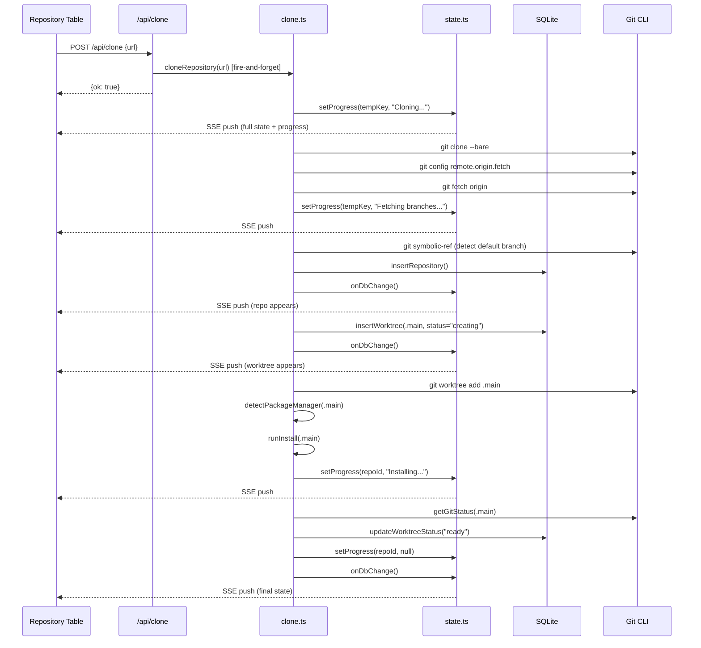
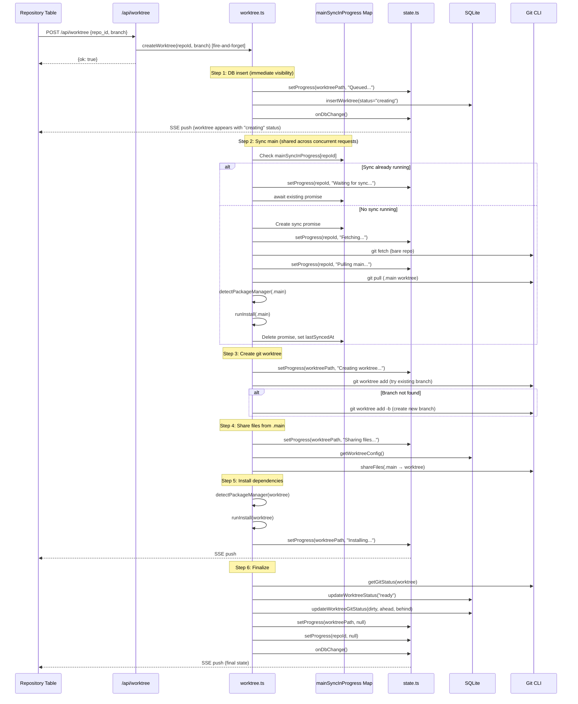
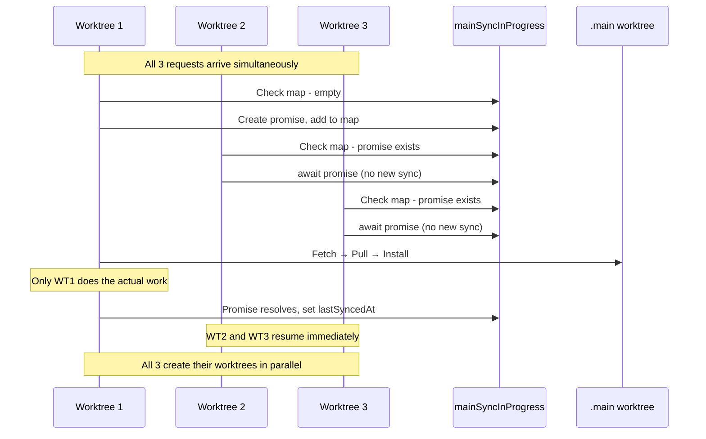

# Worktree Flow Diagrams

## Architecture Overview

Grove uses a **server-pushed state** architecture:
- Single SSE endpoint (`/api/state`) pushes full state on every change
- Fire-and-forget API calls - no response needed, state arrives via SSE
- Progress tracked in-memory on server, included in state pushes
- No optimistic UI - server is single source of truth

## Clone Repository Flow



## Create Worktree Flow



## Concurrent Worktree Creation

The `mainSyncInProgress` Map ensures main sync is shared across concurrent requests:



Additionally, a 10-second cooldown (`SYNC_COOLDOWN_MS`) skips sync entirely if main was recently synced.

## Server State

```typescript
// state.ts - Server-side state manager
type FullState = {
  repositories: RepoWithWorktrees[];
  progress: Record<string, string>;  // path → message
};

// In-memory progress tracking
const progress = new Map<string, string>();

// SSE listeners
const listeners = new Set<(state: FullState) => void>();

// Called after any mutation
function pushState(): void {
  const state = getFullState();
  for (const listener of listeners) {
    listener(state);
  }
}
```

## UI State

The UI simply receives and renders server state:

```typescript
// repository-table.tsx
const [state, setState] = useState<FullState>({
  repositories: initialRepositories,
  progress: {},
});

useEffect(() => {
  const eventSource = new EventSource("/api/state");
  eventSource.onmessage = (event) => {
    setState(JSON.parse(event.data));
  };
  return () => eventSource.close();
}, []);
```

## Key Design Decisions

### 1. Server-Pushed State
- No polling, no debounced fetches
- Server pushes complete state on every change
- UI is a pure renderer of server state

### 2. DB Insert Before Work
Worktree is inserted to DB immediately (status="creating") so:
- UI sees it right away via SSE push
- Progress can be tracked against the record
- Cleanup is straightforward on error (delete from DB)

### 3. Main Sync Sharing
Concurrent worktree creations share the same main sync:
- First request does fetch/pull/install
- Others wait on the same promise
- 10-second cooldown skips sync if recently done

### 4. Warm Cache Pattern
Main is installed before worktree install so:
- Package manager cache is populated
- Worktree install is fast (cache hit)
- Works with npm, pnpm, yarn, bun

### 5. Fire-and-Forget APIs
- POST requests return immediately with `{ok: true}`
- Actual work happens async
- Results arrive via SSE state push
